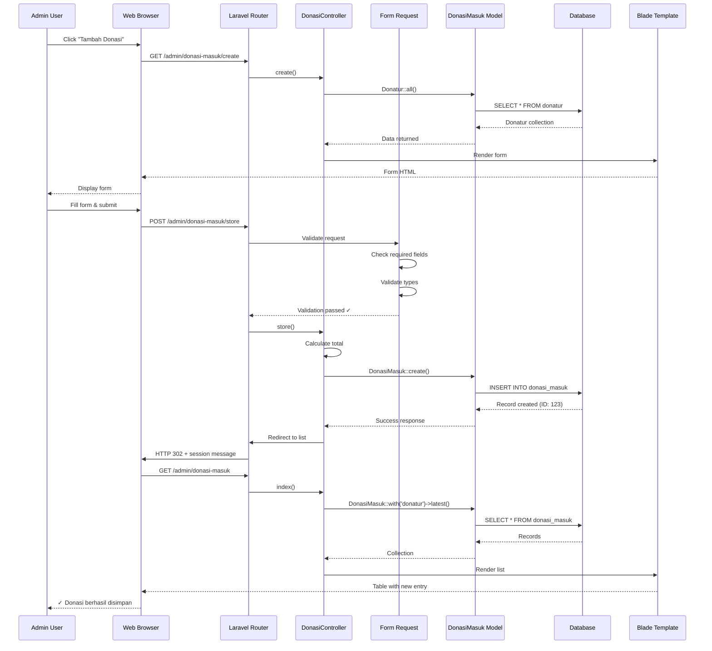
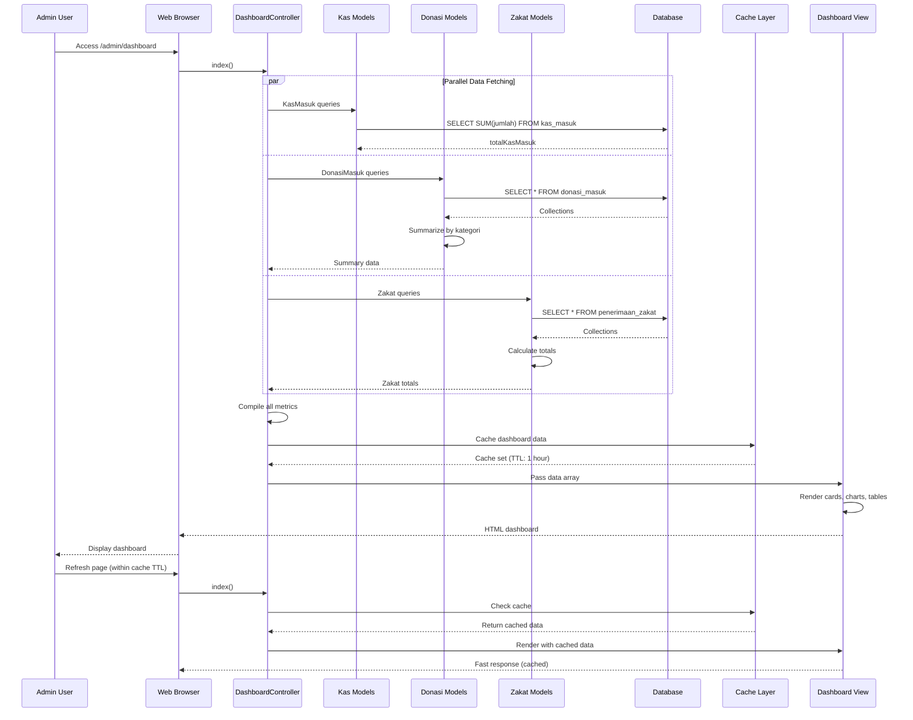
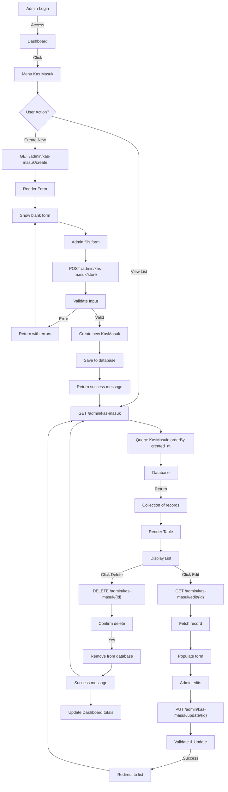
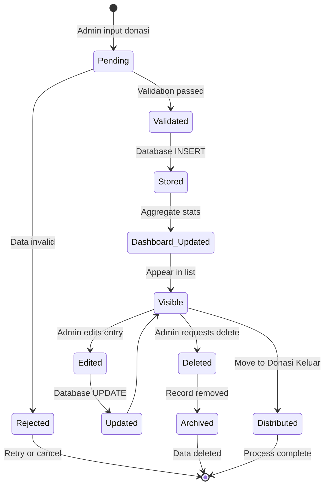
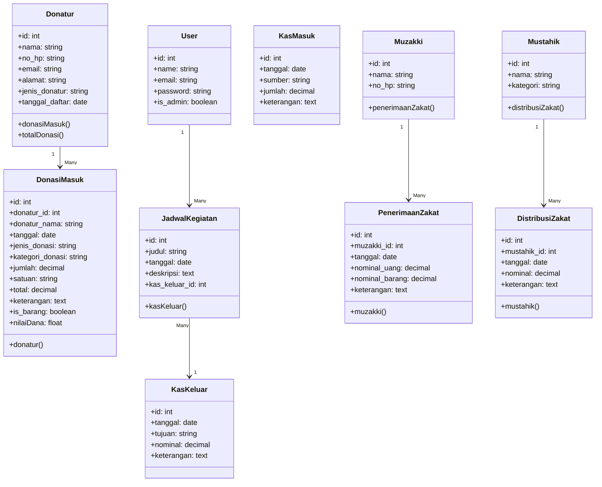

# 📋 Dokumentasi Arsitektur Sistem Lengkap - DKM Masjid

**Versi:** 1.0  
**Tanggal:** April 2026  
**Deskripsi:** Dokumentasi lengkap sistem manajemen DKM Masjid mencakup komponen utama, integrasi, alur kerja, dan visualisasi proses berbisnis.

---

## 🎯 Ringkasan Eksekutif

Sistem DKM Masjid adalah aplikasi **web berbasis Laravel 12** yang dirancang sebagai platform terpadu untuk mengelola operasional masjid modern. Sistem ini mengintegrasikan empat domain utama operasional masjid:

1. **Keuangan & Kas** (Kas Masuk/Keluar)
2. **Donasi** (Penerimaan & Distribusi)
3. **Zakat** (Penerimaan & Distribusi)
4. **Manajemen Operasional** (Pengurus, Kegiatan, Jadwal, Berita, Galeri)

Dengan arsitektur **MVC monolith** yang sederhana namun powerful, sistem ini menyediakan dashboard terpusat untuk pengambilan keputusan administratif dan portal informasi untuk publik.

---

## 1️⃣ KOMPONEN UTAMA SISTEM

### 1.1 Arsitektur Berlapis (Layered Architecture)

```
┌─────────────────────────────────────────────────┐
│      PRESENTATION LAYER (Frontend UI)           │
│  • Blade Templates (Admin)                      │
│  • Blade Templates (Public)                     │
│  • Tailwind CSS + Alpine.js                     │
└─────────────────────────────────────────────────┘
                        ↓
┌─────────────────────────────────────────────────┐
│      ROUTING & MIDDLEWARE LAYER                 │
│  • /admin/* - Panel Admin (Protected)           │
│  • / - Frontend Publik                          │
│  • Middleware: auth, admin, nocache             │
└─────────────────────────────────────────────────┘
                        ↓
┌─────────────────────────────────────────────────┐
│      APPLICATION LAYER (Controllers)            │
│  • Admin Controllers (13 controllers)           │
│  • Request Validation (Form Requests)           │
│  • Business Logic Orchestration                 │
└─────────────────────────────────────────────────┘
                        ↓
┌─────────────────────────────────────────────────┐
│      DOMAIN & SERVICE LAYER                     │
│  • Service Classes (Business Rules)             │
│  • Model Relationships                          │
│  • Data Transformations                         │
└─────────────────────────────────────────────────┘
                        ↓
┌─────────────────────────────────────────────────┐
│      DATA ACCESS LAYER (Eloquent ORM)           │
│  • Model Definitions                            │
│  • Database Queries                             │
│  • Relationships & Scopes                       │
└─────────────────────────────────────────────────┘
                        ↓
┌─────────────────────────────────────────────────┐
│      DATABASE LAYER (PostgreSQL/MySQL)          │
│  • 15+ Tables                                   │
│  • Migrations for Version Control               │
│  • Constraints & Indexes                        │
└─────────────────────────────────────────────────┘
```

---

### 1.2 FRONTEND

#### **Teknologi Stack:**
- **View Engine:** Laravel Blade Templates
- **Styling:** Tailwind CSS v3.1
- **Interactivity:** Alpine.js v3.4
- **Build Tool:** Vite v7
- **Package Manager:** npm

#### **Komponen Frontend:**

| Folder | Tujuan | Teknologi |
|--------|--------|-----------|
| `resources/css` | Global styles & component CSS | Tailwind CSS |
| `resources/js` | JavaScript components & utilities | Alpine.js |
| `resources/views/frontend` | Public-facing pages (beranda, info) | Blade |
| `resources/views/admin` | Admin dashboard & CRUD interfaces | Blade + Tailwind |

#### **Sub-modul Admin Frontend:**

```
resources/views/admin/
├── dashboard/              # Dashboard overview
├── kas_masuk/             # Input/kelola kas masuk
├── kas_keluar/            # Input/kelola kas keluar
├── donasi/                # Manajemen donasi
├── zakat/                 # Manajemen zakat
├── kegiatan/              # Jadwal kegiatan masjid
├── berita/                # Manajemen artikel berita
├── galeri/                # Manajemen foto galeri
├── pengurus/              # Data pengurus masjid
├── pengguna/              # Manajemen user admin
├── profil-masjid/         # Info profil masjid
└── layouts/               # Layout templates
```

---

### 1.3 BACKEND

#### **Teknologi Stack:**
- **Framework:** Laravel 12
- **Language:** PHP 8.2+
- **ORM:** Eloquent
- **Database:** PostgreSQL
- **Authentication:** Laravel Sanctum / Sessions

#### **Struktur Backend:**

```
app/
├── Http/
│   ├── Controllers/
│   │   ├── Admin/               # 13 admin controllers
│   │   │   ├── DashboardController
│   │   │   ├── KasMasukController
│   │   │   ├── KasKeluarController
│   │   │   ├── DonasiController
│   │   │   ├── ZakatController
│   │   │   ├── KegiatanController
│   │   │   ├── PengurusController
│   │   │   ├── BeritaController
│   │   │   ├── GaleriController
│   │   │   ├── ProfilMasjidController
│   │   │   ├── AdminUserController
│   │   │   ├── DonaturController
│   │   │   └── StatistikController
│   │   ├── Auth/                # Authentication controllers
│   │   ├── HomeController       # Frontend homepage
│   │   └── ProfileController    # User profile
│   ├── Middleware/
│   │   ├── AdminOnly.php        # Restrict to admin users
│   │   └── NoCache.php          # Prevent caching admin pages
│   └── Requests/                # Form request validations
├── Models/                      # 15 Eloquent models
│   ├── User
│   ├── KasMasuk
│   ├── KasKeluar
│   ├── DonasiMasuk
│   ├── DonasiKeluar
│   ├── Donatur
│   ├── Muzakki
│   ├── Mustahik
│   ├── PenerimaanZakat
│   ├── DistribusiZakat
│   ├── JadwalKegiatan
│   ├── JadwalImam
│   ├── DataImam
│   ├── Pengurus
│   ├── Berita
│   ├── Galeri
│   └── ProfilMasjid
├── Providers/
│   └── AppServiceProvider.php
└── Mail/
    └── SendOtpMail.php          # Email notification
```

#### **Controller Layers:**

**Layer 1: Presentation/HTTP**
- Request validation & sanitation
- Response formatting
- View data preparation

**Layer 2: Application Logic**
- Business rule enforcement
- Data aggregation
- Relationship management

**Layer 3: Model/Access**
- Database queries via Eloquent
- Data retrieval & persistence

---

### 1.4 DATABASE

#### **Teknologi:**
- **Engine:** MySQL 8.0+ atau PostgreSQL 13+
- **ORM:** Laravel Eloquent
- **Migrations:** Version-controlled schema

#### **Schema Overview (15 Tables):**

```
┌─────────────────────────────────────────────────────────┐
│                    CORE TABLES                          │
├─────────────────────────────────────────────────────────┤
│ • users                    # User accounts & authentication
│ • profil_masjid            # Organizational info
│ • pengurus                 # Staff/management
│ • data_imam                # Imam data
└─────────────────────────────────────────────────────────┘

┌─────────────────────────────────────────────────────────┐
│               FINANCIAL TABLES                          │
├─────────────────────────────────────────────────────────┤
│ • kas_masuk                # Cash inflows (donations, etc)
│ • kas_keluar               # Cash outflows (expenses)
│ • jadwal_kegiatan          # Activity budgets (FK: kas_keluar)
└─────────────────────────────────────────────────────────┘

┌─────────────────────────────────────────────────────────┐
│                DONATION TABLES                          │
├─────────────────────────────────────────────────────────┤
│ • donatur                  # Donor profiles
│ • donasi_masuk             # Received donations (FK: donatur)
│ • donasi_keluar            # Distributed donations
└─────────────────────────────────────────────────────────┘

┌─────────────────────────────────────────────────────────┐
│                  ZAKAT TABLES                           │
├─────────────────────────────────────────────────────────┤
│ • muzakki                  # Zakat payers
│ • penerimaan_zakat         # Zakat receipts (FK: muzakki)
│ • mustahik                 # Zakat recipients
│ • distribusi_zakat         # Zakat distribution (FK: mustahik)
└─────────────────────────────────────────────────────────┘

┌─────────────────────────────────────────────────────────┐
│              OPERATIONAL TABLES                         │
├─────────────────────────────────────────────────────────┤
│ • jadwal_kegiatan          # Mosque activities schedule
│ • jadwal_imam              # Imam prayer schedule
│ • berita                   # News/articles
│ • galeris                  # Photo galleries
│ • password_reset_otps      # OTP for auth
└─────────────────────────────────────────────────────────┘
```

#### **Key Relationships:**

```
User (1) ──→ (Many) JadwalKegiatan
User (1) ──→ (Many) Pengurus

Donatur (1) ──→ (Many) DonasiMasuk
Muzakki (1) ──→ (Many) PenerimaanZakat
Mustahik (1) ──→ (Many) DistribusiZakat

JadwalKegiatan (1) ──→ (1) KasKeluar
DataImam (1) ──→ (Many) JadwalImam

KasMasuk, KasKeluar (1) ──→ Parent Transaction History
```

#### **Migration Timeline (43 migrations):**

- **Phase 1:** Core tables (users, cache, jobs)
- **Phase 2:** Financial module (kas_masuk, kas_keluar)
- **Phase 3:** Operational (pengurus, jadwal_kegiatan, jadwal_imam)
- **Phase 4:** Authentication (OTP, password reset)
- **Phase 5:** Content (profil_masjid, berita, galeri)
- **Phase 6:** Donation module (donasi_masuk, donasi_keluar, donatur)
- **Phase 7:** Zakat module (muzakki, penerimaan_zakat, mustahik, distribusi_zakat)
- **Phase 8:** Refinements & Field Additions

---

### 1.5 INTEGRASI PIHAK KETIGA (Third-Party Integration)

#### **External Services:**

| Service | Purpose | Status | Config |
|---------|---------|--------|--------|
| **Email (Laravel Mail)** | OTP, notifications | Active | `config/mail.php` |
| **Cloud Storage** | File uploads (future) | Ready | `config/filesystems.php` |
| **Session Management** | User sessions | Active | `config/session.php` |
| **Cache Layer** | Performance optimization | Active | `config/cache.php` |
| **Queue System** | Async job processing | Ready | `config/queue.php` |

#### **Mail Service Stack:**

```
┌─────────────────────────────────┐
│   User Registration/OTP         │
│   (Requires Email)              │
└────────────┬────────────────────┘
             ↓
┌─────────────────────────────────┐
│   Laravel Mail Driver           │
│   (SMTP Configuration)          │
└────────────┬────────────────────┘
             ↓
┌─────────────────────────────────┐
│   SendOtpMail Mailable          │
│   (app/Mail/SendOtpMail.php)    │
└────────────┬────────────────────┘
             ↓
┌─────────────────────────────────┐
│   External SMTP Server          │
│   (Gmail, Mailtrap, etc)        │
└─────────────────────────────────┘
```

#### **Teknologi yang Digunakan:**

- **mailer:** SMTP (Gmail, Mailgun, etc)
- **sessions:** Database atau file-based
- **cache:** Redis (optional) atau file
- **queue (Future):** Redis Queue atau Database Queue

---

## 2️⃣ ALUR KERJA (WORKFLOW) SISTEM

### 2.1 Alur Umum Request-Response

```
User Browser
    ↓
[1] HTTP Request
    ↓
Laravel Router (routes/web.php)
    ↓
[2] Middleware Stack (auth, admin, nocache)
    ↓
Controller Action
    ↓
[3] Business Logic
    ↓
Model/Service Layer
    ↓
[4] Database Query (Eloquent)
    ↓
Database (MySQL/PostgreSQL)
    ↓
[5] Data Retrieval
    ↓
Model ← Response
    ↓
Controller (Data Processing)
    ↓
[6] Blade Template Rendering
    ↓
HTML Response
    ↓
Browser Render
```

---

### 2.2 Alur Spesifik: PENERIMAAN DONASI MASUK

**Scenario:** Admin menerima donasi dari donatur

#### **Step-by-Step Process:**

```
┌─────────────────────────────────────────────────────────┐
│ STEP 1: ADMIN MEMBUKA FORM DONASI MASUK                │
├─────────────────────────────────────────────────────────┤
│ • Admin login & access /admin/donasi-masuk/create      │
│ • Controller: DonasiController::create()               │
│ • Query: Fetch all Donatur records (dropdown)          │
│ • View: resources/views/admin/donasi/create.blade      │
│ • Response: Form HTML (Blade template)                 │
└─────────────────────────────────────────────────────────┘
                          ↓
┌─────────────────────────────────────────────────────────┐
│ STEP 2: ADMIN MENGISI DATA DONASI                      │
├─────────────────────────────────────────────────────────┤
│ Form Fields:                                            │
│ • donatur_id (dropdown atau optional)                  │
│ • donatur_nama (fallback jika donor tidak terdaftar)  │
│ • tanggal                                              │
│ • jenis_donasi (Uang/Barang/Makanan/etc)             │
│ • kategori_donasi (Infaq/Sedekah/Hibah)              │
│ • jumlah (numeric)                                    │
│ • satuan (untuk barang: kg, pcs, dll)                │
│ • total (calculated dari jumlah)                      │
│ • keterangan (optional notes)                         │
│                                                        │
│ Validation Rules (Laravel Form Request):             │
│ • donatur_nama: required|string|max:255             │
│ • tanggal: required|date                            │
│ • jenis_donasi: required|in:Uang,Barang,etc        │
│ • jumlah: required|numeric|min:0.01               │
│ • total: calculated (jumlah * harga barang)        │
└─────────────────────────────────────────────────────────┘
                          ↓
┌─────────────────────────────────────────────────────────┐
│ STEP 3: SUBMIT FORM (POST REQUEST)                     │
├─────────────────────────────────────────────────────────┤
│ • Method: POST /admin/donasi-masuk/store              │
│ • Controller: DonasiController::store()               │
│ • Request Validation (Form Request)                    │
│ • If validation fails → Return to form with errors     │
└─────────────────────────────────────────────────────────┘
                          ↓
┌─────────────────────────────────────────────────────────┐
│ STEP 4: BUSINESS LOGIC & DATA PROCESSING              │
├─────────────────────────────────────────────────────────┤
│ 1. Validate input data                                │
│ 2. Check if donatur exists (by donatur_id)           │
│ 3. Calculate total nilai donasi:                     │
│    - If jenis='Uang': total = jumlah                 │
│    - If jenis='Barang': total = jumlah x harga       │
│ 4. Auto-detect: $is_barang attribute                │
│ 5. Format currency (Rp format) & units              │
│ 6. Prepare data for storage                         │
└─────────────────────────────────────────────────────────┘
                          ↓
┌─────────────────────────────────────────────────────────┐
│ STEP 5: DATABASE OPERATION                             │
├─────────────────────────────────────────────────────────┤
│ • Model: DonasiMasuk::create($data)                    │
│ • Table: donasi_masuk                                 │
│ • Query: INSERT INTO donasi_masuk (...)               │
│ • Result: Record saved with auto-generated ID         │
│                                                        │
│ Inserted Fields:                                      │
│ ├─ id (auto increment)                              │
│ ├─ donatur_id (FK or null)                          │
│ ├─ donatur_nama                                     │
│ ├─ tanggal                                          │
│ ├─ jenis_donasi                                     │
│ ├─ kategori_donasi                                  │
│ ├─ jumlah                                           │
│ ├─ satuan                                           │
│ ├─ total                                            │
│ ├─ keterangan                                       │
│ ├─ created_at (timestamp)                           │
│ └─ updated_at (timestamp)                           │
└─────────────────────────────────────────────────────────┘
                          ↓
┌─────────────────────────────────────────────────────────┐
│ STEP 6: DASHBOARD UPDATE                              │
├─────────────────────────────────────────────────────────┤
│ • When DashboardController::index() runs:            │
│ • Fetch latest DonasiMasuk records (with donatur)   │
│ • Calculate ringkasanDonasiMasuk (summary stats)     │
│ • By jenis_donasi & kategori_donasi grouping        │
│ • Sum totals for display                            │
└─────────────────────────────────────────────────────────┘
                          ↓
┌─────────────────────────────────────────────────────────┐
│ STEP 7: RESPONSE & NOTIFICATION                       │
├─────────────────────────────────────────────────────────┤
│ • Redirect to /admin/donasi-masuk                      │
│ • Session message: "Donasi berhasil disimpan"         │
│ • Display updated list with new entry                 │
│ • Admin sees immediate confirmation                   │
└─────────────────────────────────────────────────────────┘

Timeline: ~200-500ms (depending on DB performance)
```

---

### 2.3 Alur Spesifik: FILTER & STATISTIK DASHBOARD

**Scenario:** Admin membuka Dashboard untuk melihat ringkasan keuangan

```
Admin Access /admin/dashboard
    ↓
DashboardController::index()
    ↓
[Parallel Data Aggregation]
├─ KAS:
│  ├─ KasMasuk::orderBy('tanggal', 'desc')->limit(5)
│  ├─ KasKeluar::orderBy('tanggal', 'desc')->limit(5)
│  ├─ sum('jumlah') → $totalKasMasuk
│  └─ sum('nominal') → $totalKasKeluar
│
├─ DONASI:
│  ├─ DonasiMasuk::get() → AllDonasiMasuk collection
│  ├─ DonasiKeluar::get() → AllDonasiKeluar collection
│  ├─ Summarize by jenis & kategori
│  ├─ Sum values → $totalDonasiMasuk, $totalDonasiKeluar
│  └─ Count → $jmlDonasiMasuk, $jmlDonasiKeluar
│
├─ ZAKAT:
│  ├─ PenerimaanZakat::with('muzakki')->orderBy('tanggal', 'desc')->limit(5)
│  ├─ DistribusiZakat::with('mustahik')->orderBy('tanggal', 'desc')->limit(5)
│  ├─ Sum values → $totalZakatMasuk, $totalZakatKeluar
│  └─ Count muzakki, mustahik
│
├─ KEGIATAN:
│  ├─ JadwalKegiatan::whereDate('>=', today())->count()
│  ├─ Grouping: akan_datang, hari_ini, selesai
│  └─ Sum anggaran (with kasKeluar relationship)
│
└─ OPERASIONAL:
   ├─ Pengurus::count() & orderBy
   ├─ DataImam::count() & orderBy
   ├─ Berita::latest()->limit(5)
   └─ Donatur::latest()->limit(4)
    ↓
Render views/admin/dashboard/index.blade
    ↓
Display:
├─ Top Cards (KAS totals, DONASI totals, ZAKAT totals)
├─ Charts (Donasi per kategori, Zakat distribution)
├─ Tables (Latest transactions)
├─ Sidebar stats
└─ Quick actions
    ↓
Response HTML → Browser
```

---

### 2.4 Data Flow Diagram - INPUT TO OUTPUT

```
┌──────────────────────────────────────────────────┐
│        USER (Admin/Pengurus Masjid)             │
└────────────────┬─────────────────────────────────┘
                 │
                 ▼
        [HTTP REQUEST]
        ├─ GET: Retrieve data
        ├─ POST: Create entry
        ├─ PUT: Update entry
        └─ DELETE: Remove entry
                 │
                 ▼
    [ROUTER: routes/web.php]
    ├─ Match URL to route
    ├─ Pass to controller
    └─ Apply middleware
                 │
                 ▼
    [MIDDLEWARE LAYER]
    ├─ auth: Verify login
    ├─ admin: Check is_admin
    └─ nocache: Disable admin cache
                 │
                 ▼
    [CONTROLLER ACTION]
    ├─ Receive request data
    ├─ Call validators
    ├─ Process business logic
    └─ Query models
                 │
                 ▼
    [MODEL/ELOQUENT]
    ├─ Find/Create/Update/Delete
    ├─ Apply relationships
    ├─ Transform data
    └─ Generate SQL
                 │
                 ▼
    [DATABASE]
    ├─ Execute query
    ├─ Persist/retrieve data
    └─ Return results
                 │
                 ▼
    [CONTROLLER RESPONSE]
    ├─ Prepare view data
    ├─ Format output
    └─ Return response
                 │
                 ▼
    [VIEW/BLADE TEMPLATE]
    ├─ Render HTML
    ├─ Display forms/tables
    ├─ Include Alpine.js
    └─ Apply Tailwind CSS
                 │
                 ▼
        [HTTP RESPONSE]
        ├─ HTML document
        ├─ CSS (Tailwind)
        ├─ JS (Alpine, Vite bundle)
        └─ Status code 200
                 │
                 ▼
        [BROWSER]
        ├─ Parse HTML
        ├─ Render page
        ├─ Load assets
        └─ Execute JS
```

---

## 3️⃣ VISUALISASI PROSES DENGAN MERMAID

### 3.1 Sequence Diagram: PENERIMAAN DONASI MASUK



---

### 3.2 Sequence Diagram: DASHBOARD DATA AGGREGATION



---

### 3.3 Flowchart: ALUR MANAJEMEN KAS MASUK



---

### 3.4 State Diagram: LIFECYCLE DONASI MASUK



---

### 3.5 Class Diagram: MODEL RELATIONSHIPS



---

### 3.6 Activity Diagram: ZAKAT DISTRIBUTION PROCESS

```mermaid
activity
    start
    :Admin opens Zakat Distribution;
    :View list of Mustahik (recipients);
    split
        :Select Mustahik;
        :Enter amount & date;
    join
    :Validate input;
    if (Data valid?) then
        :Save to distribusi_zakat;
        :Update Mustahik relationship;
        :Update dashboard stats;
        :Send confirmation;
        :Display success message;
    else
        :Show error messages;
        :Return to form;
        :Admin corrects input;
    endif
    :Redirect to zakat list;
    :Display updated records;
    stop
```

---

### 3.7 Entity Relationship Diagram (ERD)

```mermaid
erDiagram
    USER ||--o{ JADWAL_KEGIATAN : creates
    USER ||--o{ PASSWORD_RESET_OTP : requests
    
    DONATUR ||--o{ DONASI_MASUK : donates
    DONASI_MASUK ||--o{ KAS_MASUK : affects
    DONASI_MASUK only --o DONASI_KELUAR : maybecomes
    
    MUZAKKI ||--o{ PENERIMAAN_ZAKAT : pays
    PENERIMAAN_ZAKAT ||--o{ DISTRIBUSI_ZAKAT : splits
    MUSTAHIK ||--o{ DISTRIBUSI_ZAKAT : receives
    
    JADWAL_KEGIATAN ||--|| KAS_KELUAR : budgets
    DATA_IMAM ||--o{ JADWAL_IMAM : leads
    
    BERITA only --o GALERI : showcases
    PROFIL_MASJID only --o PENGURUS : manages
```

---

## 4️⃣ ALUR PROSES BISNIS (BUSINESS PROCESS)

### 4.1 Siklus Donasi Masuk → Keluar

```
DONASI MASUK FLOW:
┌──────────────────────────────────────────────────┐
│ 1. Donatur datang / transfer / online donation   │
│                                                   │
│ 2. Admin input ke dalam system:                  │
│    - Identitas donatur (atau guest)              │
│    - Jenis donasi (Uang/Barang/Makanan)         │
│    - Kategori (Infaq/Sedekah/Hibah)             │
│    - Jumlah dan satuan                           │
│                                                   │
│ 3. System saves → donasi_masuk table             │
│    - Auto calculate nilai dana                  │
│    - Generate ID unik                           │
│    - Timestamp created_at                       │
│                                                   │
│ 4. Dashboard updated:                            │
│    - Total donasi periode                        │
│    - Breakdown by kategori                      │
│    - Latest entries widget                      │
│                                                   │
│ 5. Data available for reports/statistics        │
└──────────────────────────────────────────────────┘
                      ↓
              [STORED IN DB]
                      ↓
┌──────────────────────────────────────────────────┐
│ DONASI KELUAR FLOW:                              │
│                                                   │
│ 1. Admin plans distribution:                    │
│    - Meeting/approval process starts            │
│    - Determine allocation per program           │
│                                                   │
│ 2. Admin input donasi keluar:                   │
│    - Date of distribution                      │
│    - Program/tujuan                            │
│    - Amount & details                          │
│    - Recipients info                           │
│                                                   │
│ 3. System saves → donasi_keluar table           │
│    - Link to donasi_masuk (if tracking)         │
│    - Mark as distributed                       │
│                                                   │
│ 4. Financial update:                            │
│    - Reduce kas balance                        │
│    - Create kas_keluar record                  │
│    - Update dashboard statistics               │
│                                                   │
│ 5. Report generated:                            │
│    - Audit trail: donasi_masuk → donasi_keluar │
│    - Impact analysis                           │
│    - Community feedback                        │
└──────────────────────────────────────────────────┘
```

---

### 4.2 Siklus Zakat

```
ZAKAT COLLECTION (PENERIMAAN ZAKAT):
┌──────────────────────────────────────────────────┐
│ 1. Muzakki (Zakat payer) identified             │
│    - Register if new                            │
│    - Or retrieve existing record                │
│                                                   │
│ 2. Zakat received:                              │
│    - Uang (cash amout)                          │
│    - Barang (goods, with volume/type)           │
│                                                   │
│ 3. Admin input → penerimaan_zakat:              │
│    - muzakki_id reference                       │
│    - tanggal penerimaan                         │
│    - nominal_uang (Rp)                          │
│    - nominal_barang (item count + type)         │
│    - detail breakdown                           │
│                                                   │
│ 4. System calculation:                          │
│    - Total monetary value                       │
│    - Conversion barang to rupiah                │
│    - Save to kas_masuk (effect on finance)      │
└──────────────────────────────────────────────────┘
                      ↓
┌──────────────────────────────────────────────────┐
│ ZAKAT DISTRIBUTION (DISTRIBUSI ZAKAT):          │
│                                                   │
│ 1. Mustahik (Recipients) identified             │
│    - 8 categories: indigent, poor, etc.         │
│                                                   │
│ 2. Distribution planning:                       │
│    - Approval from pengurus                     │
│    - Allocation by category                     │
│    - Recipients determined                      │
│                                                   │
│ 3. Admin input → distribusi_zakat:              │
│    - mustahik_id reference                      │
│    - tanggal distribusi                         │
│    - nominal uang distributed                   │
│    - nominal barang distributed                 │
│    - harga_barang_fitrah (if applicable)        │
│                                                   │
│ 4. System effects:                              │
│    - Reduce kas balance (kas_keluar)            │
│    - Update dashboard totals                    │
│    - Generate audit report                      │
│    - Track distribution history                 │
│                                                   │
│ 5. Reporting & Transparency:                    │
│    - Recipients list (private)                  │
│    - Total distributed                         │
│    - Zakat ratio vs collection                  │
└──────────────────────────────────────────────────┘
```

---

### 4.3 Manajemen Keuangan (Kas Masuk/Keluar)

```
CASH FLOW MANAGEMENT:

KAS MASUK (Cash Inflows):
├─ Jenis Sumber:
│  ├── Donasi (dari DonasiMasuk)
│  ├── Zakat (dari PenerimaanZakat)
│  ├── Infaq pembeli produk masjid
│  ├── Rental gedung
│  └── Other operational income
│
├─ Data Input:
│  ├── tanggal
│  ├── sumber (source)
│  ├── jumlah (amount)
│  └── keterangan (notes)
│
└─ Dashboard Impact:
   ├── Total kas masuk (sum)
   ├── Monthly trend
   └── Source breakdown chart

                    ↓

KAS KELUAR (Cash Outflows):
├─ Jenis Pengeluaran:
│  ├── Kegiatan masjid (from JadwalKegiatan)
│  ├── Distribution donasi & zakat
│  ├── Operational costs (electricity, water)
│  ├── Staff salary
│  ├── Maintenance & repairs
│  └── Administrative costs
│
├─ Data Input:
│  ├── tanggal
│  ├── tujuan (purpose)
│  ├── nominal (amount)
│  └── keterangan (notes)
│
├─ Validations:
│  ├── Amount > 0
│  ├── Date valid
│  ├── Balance check (optional)
│  └── Approval workflow (future)
│
└─ Dashboard Impact:
   ├── Total kas keluar (sum)
   ├── Monthly trend
   ├── Category breakdown
   └── Balance calculation: KasMasuk - KasKeluar

                    ↓

FINANCIAL SUMMARY (Dashboard):
├─ Top Cards:
│  ├── Total Kas Masuk (all time)
│  ├── Total Kas Keluar (all time)
│  ├── Net Balance
│  └── Monthly target vs actual
│
├─ Charts:
│  ├── Cash trend (line chart)
│  ├── Masuk vs Keluar (comparison)
│  ├── Category breakdown (pie)
│  └── Yearly forecast
│
└─ Reports:
   ├── Monthly statement
   ├── Audit trail
   └── Financial health metrics
```

---

## 5️⃣ INTEGRASI SISTEM KESELURUHAN

### 5.1 Component Integration Map

```
┌─────────────────────────────────────────────────────────┐
│                    FRONTEND LAYER                       │
│         (Blade Templates + Tailwind + Alpine)          │
├─────────────────────────────────────────────────────────┤

    Dashboard ←──→ Kas Modul ←──→ Donasi Modul
       ↓           ↓               ↓
    Statistics  (View/Create)   (View/Create)
       ↓           ↓               ↓
    Charts      Forms           Forms
       ↓           ↓               ↓
  Widgets       Validation      Validation

    Zakat Modul ←──→ Kegiatan Modul ←──→ Content Modul
        ↓                ↓                  ↓
   (View/Create)    (Jadwal/Imam)    (Berita/Galeri)
        ↓                ↓                  ↓
     Forms           Forms              Forms
        ↓                ↓                  ↓

├─────────────────────────────────────────────────────────┤
│         ROUTING & MIDDLEWARE LAYER                      │
│  • Route matching (routes/web.php)                      │
│  • Authentication middleware                            │
│  • Authorization (admin-only)                           │
│  • Request/Response handling                            │
├─────────────────────────────────────────────────────────┤

    GET /admin/* ──→ 13 Controllers ──→ POST/PUT/DELETE
         ↓                  ↓                  ↓
    Route params      Business logic    Form validation

├─────────────────────────────────────────────────────────┤
│         APPLICATION LAYER (Controllers)                 │
│  • DashboardController (aggregation)                    │
│  • KasMasuk/KasKeluarControllers                        │
│  • Donasi/DonaturControllers                            │
│  • Zakat/Muzakki/MustahikControllers                    │
│  • Kegiatan/ImamControllers                             │
│  • Content (Berita/Galeri) Controllers                  │
│  • Admin user management                                │
├─────────────────────────────────────────────────────────┤

         ↓ Model calls ↓ Query builder ↓

├─────────────────────────────────────────────────────────┤
│      MODEL LAYER (Eloquent ORM)                         │
│  • 15 Models with relationships                         │
│  • Data transformation                                  │
│  • Business attributes (e.g., is_barang)               │
│  • Query scopes (future enhancement)                    │
├─────────────────────────────────────────────────────────┤

         ↓ SQL generation ↓

├─────────────────────────────────────────────────────────┤
│              DATABASE LAYER                             │
│  • PostgreSQL / MySQL (configurable)                    │
│  • 15+ tables with indexes                              │
│  • Foreign key constraints                              │
│  • Transaction support                                  │
├─────────────────────────────────────────────────────────┤

         ↓ Results ↓

├─────────────────────────────────────────────────────────┤
│           CACHE LAYER (Optional)                        │
│  • Redis or File-based caching                          │
│  • Dashboard stats caching                              │
│  • Session management                                   │
├─────────────────────────────────────────────────────────┤

         ↓ Response data ↓

└─────────────────────────────────────────────────────────┘
```

---

### 5.2 Data Cross-Module Communication

```
EXAMPLE: Dashboard pulling data from all modules

DashboardController::index()
    │
    ├─→ Kas Module:
    │   ├─ KasMasuk::sum('jumlah')
    │   └─ KasKeluar::sum('nominal')
    │
    ├─→ Donasi Module:
    │   ├─ DonasiMasuk::with('donatur')->latest(5)
    │   ├─ DonasiKeluar::latest(5)
    │   └─ Calculate totals by kategori
    │
    ├─→ Zakat Module:
    │   ├─ PenerimaanZakat::with('muzakki')->latest(5)
    │   ├─ DistribusiZakat::with('mustahik')->latest(5)
    │   ├─ Muzakki::count()
    │   └─ Mustahik::count()
    │
    ├─→ Kegiatan Module:
    │   ├─ JadwalKegiatan::with('kasKeluar')->whereDate('>=', now()).count()
    │   └─ Sum anggaran kegiatan
    │
    ├─→ Operational:
    │   ├─ Pengurus::count()
    │   ├─ DataImam::count()
    │   └─ Donatur::latest(4)
    │
    └─→ Aggregate all data:
        ├─ Format for display
        ├─ Calculate percentages
        ├─ Cache result
        └─ Return to view

View renders:
├─ Top metrics cards
├─ Charts/graphs (by kategori, trend, etc)
├─ Latest entries tables
├─ Quick stats
└─ Navigation shortcuts
```

---

## 6️⃣ TEKNOLOGI STACK DETAIL

### 6.1 Backend Stack

```
┌─ Framework
│  └─ Laravel 12
│     ├─ Routing
│     ├─ Middleware
│     ├─ Controllers
│     ├─ Models (Eloquent ORM)
│     └─ Blade template engine
│
├─ Language & Runtime
│  └─ PHP 8.2+
│     ├─ Type hints
│     ├─ Named arguments
│     └─ Attributes
│
├─ Database
│  ├─ MySQL 8.0+ / PostgreSQL 13+
│  ├─ Query builder
│  └─ Migrations
│
├─ Authentication
│  ├─ Laravel Sessions
│  ├─ Sanctum (for tokens)
│  └─ bcrypt password hashing
│
├─ Mail Service
│  └─ Laravel Mail Driver
│     ├─ SMTP configuration
│     ├─ Mailable classes
│     └─ OTP delivery
│
├─ Additional Libraries
│  ├─ Doctrine DBAL (migrations)
│  └─ Laravel Breeze (pre-built auth)
│
└─ Development Tools
   ├─ PHPUnit (tests)
   ├─ Tinker (REPL)
   ├─ Pail (logs)
   ├─ Pint (coding standards)
   └─ Collision (error handler)
```

### 6.2 Frontend Stack

```
┌─ View Engine
│  └─ Laravel Blade
│     ├─ PHP-based templating
│     ├─ Directives (@if, @foreach, etc)
│     └─ Component system
│
├─ Styling
│  ├─ Tailwind CSS v3.1
│  │  ├─ Utility-first CSS
│  │  ├─ Responsive classes
│  │  ├─ Dark mode support
│  │  └─ @tailwindcss/forms plugin
│  │
│  └─ PostCSS
│     ├─ Autoprefixer
│     └─ Tailwind processor
│
├─ JavaScript Framework
│  └─ Alpine.js v3.4
│     ├─ Lightweight reactive UI
│     ├─ DOM manipulation
│     ├─ Event handling
│     └─ Data binding
│
├─ HTTP Client
│  └─ Axios v1.11
│     ├─ AJAX requests
│     ├─ Promise-based
│     └─ Interceptors
│
├─ Build Tools
│  ├─ Vite v7
│  │  ├─ Module bundler
│  │  ├─ HMR (Hot Module Replacement)
│  │  └─ Code splitting
│  │
│  ├─ laravel-vite-plugin
│  │  └─ Laravel ↔ Vite integration
│  │
│  └─ npm/node package manager
│     └─ Dependency management
│
└─ Development
   ├─ npm scripts
   │  ├─ npm run dev (development)
   │  └─ npm run build (production)
   │
   └─ File watcher
      └─ Automatic rebuild on file change
```

### 6.3 DevOps & Infrastructure

```
┌─ Local Development
│  ├─ PHP 8.5.3 (bundled)
│  ├─ npm for frontend
│  └─ composer for backend
│
├─ Web Server
│  ├─ Apache / Nginx (production)
│  └─ php artisan serve (development)
│
├─ Runtime Environment
│  ├─ PHP-FPM
│  ├─ Database service (MySQL/PostgreSQL)
│  └─ Redis (optional, for cache/queue)
│
├─ Deployment
│  ├─ Environment files (.env)
│  ├─ Configuration management
│  └─ Migration system
│
└─ Concurrency (Development)
   └─ Concurrent script runners
      ├─ php artisan serve (server)
      ├─ php artisan queue:listen (queue)
      ├─ PHP artisan pail (logs)
      └─ npm run dev (frontend)
```

---

## 7️⃣ KEAMANAN & BEST PRACTICES

### 7.1 Security Measures

```
AUTHENTICATION & AUTHORIZATION:
├─ Password Hashing: bcrypt (Laravel default)
├─ Session Management: Secure session cookies
├─ Admin Middleware: Verify is_admin flag
└─ OTP System: Time-limited password reset

PROTECTION LAYERS:
├─ CSRF Protection: Hidden tokens in forms
├─ SQL Injection: Parametrized queries (Eloquent)
├─ XSS Prevention: Blade escaping
├─ Cache Disabling: nocache middleware for admin
├─ HTTPS: Recommended for production
└─ Data Validation: Server-side validation in controllers

API SECURITY (Future):
├─ Token-based auth (Laravel Sanctum)
├─ Rate limiting
├─ API versioning
└─ Environment-specific keys
```

### 7.2 Data Integrity

```
DATABASE CONSTRAINTS:
├─ Foreign Keys: Referential integrity
├─ Timestamps: created_at, updated_at
├─ Type Casting: Decimal for currency values
├─ Nullable Columns: Marked where optional
└─ Unique Indexes: Email fields, IDs

QUERY PATTERNS:
├─ N+1 prevention: use with() for relationships
├─ Soft deletes: Support for audit trails
├─ Timestamps: Auto-tracked record changes
└─ Transactions: Future feature for multi-step operations
```

---

## 8️⃣ DEPLOYMENT & SCALING ROADMAP

### 8.1 Current State (Single Server)

```
Single Server Setup:
┌────────────────────────────┐
│   Web Server (Apache/Nginx)│
│   ├─ Laravel App           │
│   ├─ PHP-FPM               │
│   └─ Static files          │
└────────────────────────────┘
           │
           ├─→ Database Server (PostgreSQL)
           │
           └─→ File Storage (Local)
```

### 8.2 Recommended Production Setup

```
Production Architecture:
                    │
            ┌───────┴───────┐
            │               │
        AWS/GCP         On-premise
            │               │
    ┌───────┴───────┐   ┌───┴───┐
    │               │   │       │
  Load Balancer  CDN  Web 1  Web 2
    │               │   │       │
  ┌─┴─────┬─────────┘   └───┬───┘
  │       │                 │
Cache  Database          File Storage
(Redis) (Managed         (S3/NAS)
       DB)

Benefits:
├─ Horizontal scaling (multiple app servers)
├─ Load balancing for high traffic
├─ CDN for static asset delivery
├─ Managed database service
├─ Centralized file storage
└─ Real-time caching layer
```

---

## 9️⃣ PERFORMANCE OPTIMIZATION

### 9.1 Query Optimization

```
CURRENT ISSUES & SOLUTIONS:

Problem: N+1 Query Issue in DonasiMasuk
Before:
    foreach ($donasiBulk as $donasi) {
        echo $donasi->donatur->nama;  // Extra query per item!
    }

Solution (with() eager loading):
    $donasi = DonasiMasuk::with('donatur')->get();
    foreach ($donasi as $d) {
        echo $d->donatur->nama;  // Already loaded!
    }

RECOMMENDED OPTIMIZATIONS:
├─ Add database indexes on frequently queried fields
│  └─ Example: tanggal, donatur_id, jenis_donasi
├─ Implement query result caching
│  └─ Cache dashboard data for 1 hour
├─ Use pagination for large lists
│  └─ Instead of loading all records at once
├─ Lazy loading for secondary data
│  └─ Don't load unnecessary relationships
└─ Query scoping for common filters
   └─ Define reusable query methods on models
```

### 9.2 Caching Strategy

```
WHAT TO CACHE:

Short-lived Cache (5-15 min):
├─ Dashboard statistics
├─ Top-level KPI cards
└─ Recent activity lists

Medium-lived Cache (30 min - 1 hour):
├─ Donatur list (dropdown)
├─ Muzakki & Mustahik lists
├─ Static content (Berita, Galeri)
└─ Category lookups

Long-lived Cache (24 hours):
├─ Pengurus data
├─ Profil Masjid info
├─ System configuration
└─ Master data (imam, etc)

HOW TO IMPLEMENT:
    // In controller:
    $stats = Cache::remember('dashboard-stats', 3600, function () {
        return [
            'total_kas' => KasMasuk::sum('jumlah'),
            'total_donasi' => DonasiMasuk::sum('total'),
        ];
    });

Cache invalidation on:
    ├─ New record creation
    ├─ Record update
    ├─ Record deletion
    └─ Manual refresh action
```

---

## 🔟 MONITORING & MAINTENANCE

### 10.1 Logging Strategy

```
LOG LEVELS:

DEBUG: Development only
├─ Query execution
├─ Variable values
└─ Step-by-step flow

INFO: Normal operations
├─ User login/logout
├─ Data CRUD operations
├─ Administrative actions
└─ System events

WARNING: Potential issues
├─ Slow queries
├─ High memory usage
├─ Failed validations
└─ Cache misses

ERROR: Operational problems
├─ Database connection errors
├─ Failed transactions
├─ Payment processing errors
└─ File operation failures

CRITICAL: System failures
├─ Database offline
├─ Server down
├─ Authentication service failure
└─ Disk full

LOG FILES (storage/logs/):
└─ laravel.log (unified application log)
   ├─ Rotated daily
   └─ 14-day retention
```

### 10.2 System Health Checks

```
HEALTH CHECK ITEMS:

Database:
├─ Connection status
├─ Disk space
└─ Query performance

Application:
├─ Error rate
├─ Response time
├─ Memory usage
└─ CPU usage

Cache:
├─ Redis connection
├─ hit/miss ratio
└─ Eviction rate

Files:
├─ Storage quota
├─ Backup status
└─ Log rotation

Security:
├─ Failed login attempts
├─ Password strength policy
└─ Session expiry
```

---

## KESIMPULAN

DKM Masjid adalah sistem manajemen masjid modern yang:

✅ **Komprehensif**: Mencakup 4 domain utama (Kas, Donasi, Zakat, Operasional)
✅ **Terintegrasi**: Satu dashboard untuk semua data penting
✅ **Scalable**: Arsitektur siap untuk pertumbuhan
✅ **Aman**: Lapisan keamanan multilevel
✅ **User-friendly**: Interface intuitif dengan Tailwind CSS
✅ **Maintainable**: Kode terstruktur sesuai Laravel best practices

**Next Steps untuk Produksi:**
1. Implement caching strategy
2. Add comprehensive logging
3. Setup automated backups
4. Deploy to production server
5. Configure monitoring alerts
6. Document API endpoints (if API needed)
7. Add user training materials

---

**Document Version:** 1.0  
**Last Updated:** April 7, 2026  
**Author:** System Architecture Team
