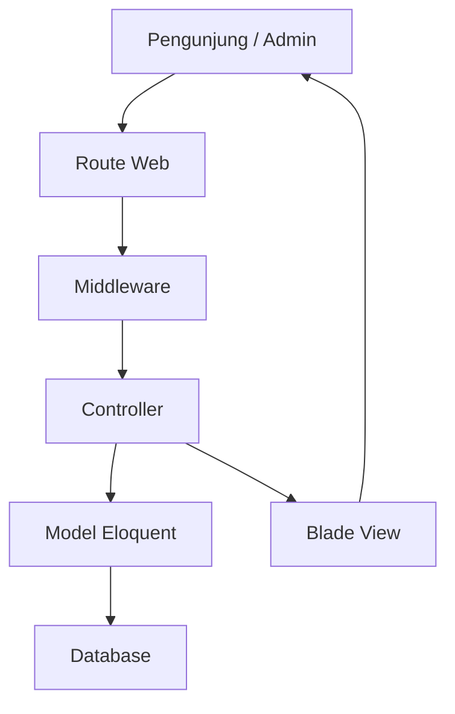
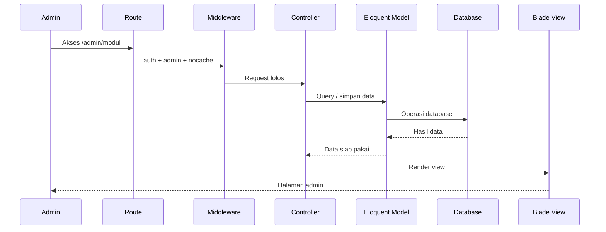
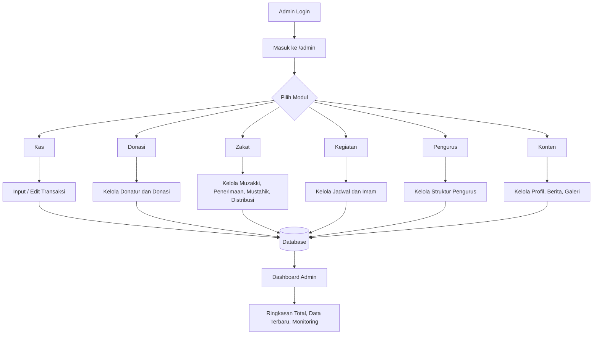
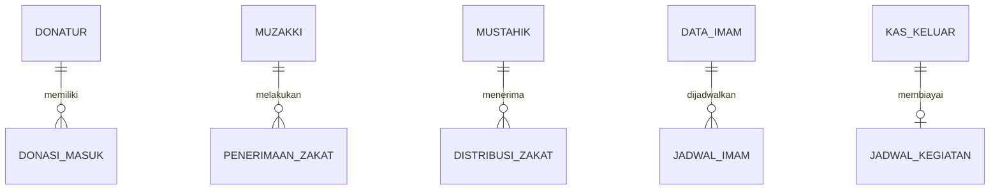

# Arsitektur Sistem DKM Masjid

## Gambaran Umum

Sistem ini dibangun sebagai aplikasi **Laravel monolith berbasis MVC** dengan **Blade** sebagai layer tampilan admin dan frontend. Pusat operasional aplikasi ada di panel admin, sedangkan sisi frontend saat ini masih sederhana dan berfungsi sebagai pintu masuk website.

Karakter arsitekturnya saat ini:

- Satu aplikasi Laravel untuk seluruh modul.
- Routing web berada di [`routes/web.php`](/c:/Users/USER/dkm_masjid/routes/web.php).
- Controller langsung berinteraksi dengan model Eloquent.
- View menggunakan Blade di folder [`resources/views`](/c:/Users/USER/dkm_masjid/resources/views).
- Dashboard admin berperan sebagai layer agregasi ringkasan data lintas modul.

## Aktor Sistem

- **Pengunjung website**
  Mengakses halaman frontend seperti beranda.
- **Admin/Pengurus Masjid**
  Mengelola data operasional melalui panel admin.
- **Entitas data operasional**
  `Donatur`, `Muzakki`, dan `Mustahik` bukan aktor login, tetapi menjadi data inti proses donasi dan zakat.

## Arsitektur Berlapis

### 1. Presentation Layer

Terdiri dari Blade template untuk:

- Frontend:
  [`resources/views/frontend`](/c:/Users/USER/dkm_masjid/resources/views/frontend)
- Admin:
  [`resources/views/admin`](/c:/Users/USER/dkm_masjid/resources/views/admin)

Modul admin dipisah per domain, misalnya:

- [`resources/views/admin/kas_masuk`](/c:/Users/USER/dkm_masjid/resources/views/admin/kas_masuk)
- [`resources/views/admin/kas_keluar`](/c:/Users/USER/dkm_masjid/resources/views/admin/kas_keluar)
- [`resources/views/admin/donasi`](/c:/Users/USER/dkm_masjid/resources/views/admin/donasi)
- [`resources/views/admin/zakat`](/c:/Users/USER/dkm_masjid/resources/views/admin/zakat)
- [`resources/views/admin/kegiatan`](/c:/Users/USER/dkm_masjid/resources/views/admin/kegiatan)
- [`resources/views/admin/berita`](/c:/Users/USER/dkm_masjid/resources/views/admin/berita)
- [`resources/views/admin/galeri`](/c:/Users/USER/dkm_masjid/resources/views/admin/galeri)

### 2. Routing Layer

Semua alur request utama masuk melalui [`routes/web.php`](/c:/Users/USER/dkm_masjid/routes/web.php).

Pola route yang digunakan:

- `/` untuk frontend
- `/admin/*` untuk seluruh panel operasional
- `/profile` untuk manajemen profil user yang sudah login

### 3. Middleware Layer

Panel admin dilindungi oleh middleware:

- `auth`
- `admin`
- `nocache`

Implementasi akses admin:

- [`app/Http/Middleware/AdminOnly.php`](/c:/Users/USER/dkm_masjid/app/Http/Middleware/AdminOnly.php)

Implementasi anti-cache:

- [`app/Http/Middleware/NoCache.php`](/c:/Users/USER/dkm_masjid/app/Http/Middleware/NoCache.php)

Artinya, semua proses administratif hanya bisa diakses user yang sudah login dan memiliki flag `is_admin`.

### 4. Application Layer

Controller bertindak sebagai penghubung antara request, validasi, model, dan view.

Controller utama admin:

- [`DashboardController.php`](/c:/Users/USER/dkm_masjid/app/Http/Controllers/Admin/DashboardController.php)
- [`KasMasukController.php`](/c:/Users/USER/dkm_masjid/app/Http/Controllers/Admin/KasMasukController.php)
- [`KasKeluarController.php`](/c:/Users/USER/dkm_masjid/app/Http/Controllers/Admin/KasKeluarController.php)
- [`DonasiController.php`](/c:/Users/USER/dkm_masjid/app/Http/Controllers/Admin/DonasiController.php)
- [`DonaturController.php`](/c:/Users/USER/dkm_masjid/app/Http/Controllers/Admin/DonaturController.php)
- [`ZakatController.php`](/c:/Users/USER/dkm_masjid/app/Http/Controllers/Admin/ZakatController.php)
- [`KegiatanController.php`](/c:/Users/USER/dkm_masjid/app/Http/Controllers/Admin/KegiatanController.php)
- [`PengurusController.php`](/c:/Users/USER/dkm_masjid/app/Http/Controllers/Admin/PengurusController.php)
- [`ProfilMasjidController.php`](/c:/Users/USER/dkm_masjid/app/Http/Controllers/Admin/ProfilMasjidController.php)
- [`BeritaController.php`](/c:/Users/USER/dkm_masjid/app/Http/Controllers/Admin/BeritaController.php)
- [`GaleriController.php`](/c:/Users/USER/dkm_masjid/app/Http/Controllers/Admin/GaleriController.php)
- [`AdminUserController.php`](/c:/Users/USER/dkm_masjid/app/Http/Controllers/Admin/AdminUserController.php)

### 5. Domain & Data Layer

Model Eloquent merepresentasikan tabel dan relasi data.

Model inti:

- Keuangan:
  [`KasMasuk.php`](/c:/Users/USER/dkm_masjid/app/Models/KasMasuk.php),
  [`KasKeluar.php`](/c:/Users/USER/dkm_masjid/app/Models/KasKeluar.php),
  [`DonasiMasuk.php`](/c:/Users/USER/dkm_masjid/app/Models/DonasiMasuk.php),
  [`DonasiKeluar.php`](/c:/Users/USER/dkm_masjid/app/Models/DonasiKeluar.php),
  [`Donatur.php`](/c:/Users/USER/dkm_masjid/app/Models/Donatur.php)
- Zakat:
  [`Muzakki.php`](/c:/Users/USER/dkm_masjid/app/Models/Muzakki.php),
  [`PenerimaanZakat.php`](/c:/Users/USER/dkm_masjid/app/Models/PenerimaanZakat.php),
  [`Mustahik.php`](/c:/Users/USER/dkm_masjid/app/Models/Mustahik.php),
  [`DistribusiZakat.php`](/c:/Users/USER/dkm_masjid/app/Models/DistribusiZakat.php)
- Kegiatan:
  [`JadwalKegiatan.php`](/c:/Users/USER/dkm_masjid/app/Models/JadwalKegiatan.php),
  [`DataImam.php`](/c:/Users/USER/dkm_masjid/app/Models/DataImam.php),
  [`JadwalImam.php`](/c:/Users/USER/dkm_masjid/app/Models/JadwalImam.php)
- Organisasi & konten:
  [`Pengurus.php`](/c:/Users/USER/dkm_masjid/app/Models/Pengurus.php),
  [`ProfilMasjid.php`](/c:/Users/USER/dkm_masjid/app/Models/ProfilMasjid.php),
  [`Berita.php`](/c:/Users/USER/dkm_masjid/app/Models/Berita.php),
  [`Galeri.php`](/c:/Users/USER/dkm_masjid/app/Models/Galeri.php),
  [`User.php`](/c:/Users/USER/dkm_masjid/app/Models/User.php)

### 6. Persistence Layer

Database dikelola melalui migration Laravel pada folder:

- [`database/migrations`](/c:/Users/USER/dkm_masjid/database/migrations)

Database menjadi sumber utama seluruh data operasional:

- transaksi kas
- transaksi donasi
- penerimaan dan distribusi zakat
- jadwal kegiatan
- data imam
- berita dan galeri

## Diagram Lapisan Sistem



## Ilustrasi Arsitektur Sistem

```mermaid
flowchart LR
    U1[Pengunjung Website]
    U2[Admin Masjid]

    subgraph LaravelApp [Aplikasi Laravel DKM Masjid]
        R[Routing Web]
        MW[Middleware<br/>auth | admin | nocache]

        subgraph Frontend [Frontend]
            HC[HomeController]
            FV[View Frontend]
        end

        subgraph AdminPanel [Panel Admin]
            DC[DashboardController]
            KC[Kas Controller]
            DONC[Donasi Controller]
            ZC[Zakat Controller]
            KG[ Kegiatan Controller ]
            PC[Pengurus Controller]
            CC[Konten Controller<br/>Profil | Berita | Galeri]
            UC[User Controller]
        end

        subgraph Domain [Domain Model / Eloquent]
            KAS[KasMasuk / KasKeluar]
            DON[Donatur / DonasiMasuk / DonasiKeluar]
            ZAKAT[Muzakki / PenerimaanZakat / Mustahik / DistribusiZakat]
            KEG[DataImam / JadwalImam / JadwalKegiatan]
            ORG[Pengurus / User]
            KONTEN[ProfilMasjid / Berita / Galeri]
        end

        DB[(Database)]
    end

    U1 --> R
    U2 --> R

    R --> HC
    HC --> FV
    FV --> U1

    R --> MW
    MW --> DC
    MW --> KC
    MW --> DONC
    MW --> ZC
    MW --> KG
    MW --> PC
    MW --> CC
    MW --> UC

    DC --> KAS
    DC --> DON
    DC --> KEG
    DC --> ORG
    DC --> KONTEN

    KC --> KAS
    DONC --> DON
    ZC --> ZAKAT
    KG --> KEG
    KG --> KAS
    PC --> ORG
    CC --> KONTEN
    UC --> ORG

    KAS --> DB
    DON --> DB
    ZAKAT --> DB
    KEG --> DB
    ORG --> DB
    KONTEN --> DB
```

Ilustrasi di atas menunjukkan bahwa:

- frontend masih sederhana dan langsung dilayani `HomeController`
- semua proses operasional masuk lewat panel admin
- middleware menjadi gerbang utama keamanan
- setiap controller admin mengelola domain datanya masing-masing
- dashboard mengambil data lintas domain sebagai pusat monitoring

## Alur Request Sistem

### A. Alur Frontend

Saat ini frontend masih tipis:

1. User membuka `/`
2. Route mengarah ke [`HomeController.php`](/c:/Users/USER/dkm_masjid/app/Http/Controllers/HomeController.php)
3. Controller mengembalikan view `frontend.home`

### B. Alur Admin

Alur umum panel admin:

1. Admin login melalui auth Laravel.
2. Request masuk ke route `/admin/*`.
3. Middleware `auth`, `admin`, dan `nocache` memvalidasi akses.
4. Controller memproses request.
5. Controller membaca/menyimpan data melalui model Eloquent.
6. Controller me-render Blade admin dengan data hasil query.

Diagram sederhananya:



## Arsitektur Modul Bisnis

### 1. Modul Dashboard

Dashboard adalah **lapisan agregasi**. Controller dashboard tidak memiliki tabel khusus, tetapi menarik ringkasan dari banyak model:

- kas masuk
- kas keluar
- anggaran kegiatan
- jadwal kegiatan
- pengurus
- data imam
- donasi masuk
- donasi keluar
- donatur
- berita
- galeri

Sumber implementasi:

- [`DashboardController.php`](/c:/Users/USER/dkm_masjid/app/Http/Controllers/Admin/DashboardController.php)

Perannya:

- menampilkan KPI
- menampilkan data terbaru
- menjadi pintu pantau seluruh sistem

### 2. Modul Keuangan Operasional

Submodul:

- Kas Masuk
- Kas Keluar
- Donasi Masuk
- Donasi Keluar
- Donatur

Fungsi bisnis:

- mencatat pemasukan internal masjid
- mencatat pengeluaran kas
- mencatat donasi uang atau barang
- mengelola master donatur

Relasi penting:

- `Donatur` memiliki banyak `DonasiMasuk`
- `DonasiMasuk` milik satu `Donatur`

### 3. Modul Zakat

Submodul:

- Muzakki
- Penerimaan Zakat
- Mustahik
- Distribusi Zakat

Fungsi bisnis:

- menyimpan data pemberi zakat
- mencatat penerimaan zakat uang atau barang
- menyimpan data penerima zakat
- mencatat penyaluran zakat

Relasi penting:

- `Muzakki` memiliki banyak `PenerimaanZakat`
- `PenerimaanZakat` milik satu `Muzakki`
- `Mustahik` memiliki banyak `DistribusiZakat`
- `DistribusiZakat` milik satu `Mustahik`

### 4. Modul Kegiatan dan SDM

Submodul:

- Pengurus
- Jadwal Kegiatan
- Data Imam
- Jadwal Imam
- Jadwal Sholat

Fungsi bisnis:

- mengelola struktur pengurus
- menyusun agenda kegiatan
- mengelola data imam
- memetakan imam ke jadwal

Relasi penting:

- `DataImam` memiliki banyak `JadwalImam`
- `JadwalImam` milik satu `DataImam`
- `KasKeluar` memiliki satu `JadwalKegiatan`
- `JadwalKegiatan` dapat terhubung ke satu `KasKeluar`

Ini menunjukkan bahwa kegiatan dapat dikaitkan langsung dengan anggaran/pengeluaran.

### 5. Modul Konten Website

Submodul:

- Profil Masjid
- Berita
- Galeri

Fungsi bisnis:

- mengelola informasi profil institusi
- publikasi berita kegiatan
- publikasi dokumentasi galeri

Modul ini lebih dekat ke kebutuhan komunikasi publik daripada transaksi operasional.

## Ilustrasi Alur Operasional Admin



## Relasi Data Inti



## Alur Data Per Modul

### Kas

1. Admin input kas masuk atau kas keluar.
2. Data disimpan ke tabel transaksi masing-masing.
3. Dashboard menarik total kas masuk, total kas keluar, dan daftar terbaru.

### Donasi

1. Admin kelola master donatur.
2. Admin input donasi masuk atau keluar.
3. Sistem menyimpan bentuk donasi uang atau barang.
4. Dashboard menghitung total nilai dana dari donasi masuk dan keluar.

### Zakat

1. Admin kelola data muzakki dan mustahik.
2. Admin input penerimaan zakat.
3. Admin input distribusi zakat.
4. Sistem menyimpan bentuk zakat uang atau barang serta nominal bila tersedia.

### Kegiatan

1. Admin membuat jadwal kegiatan.
2. Jika ada biaya, jadwal kegiatan dapat dikaitkan ke kas keluar.
3. Dashboard menghitung total anggaran kegiatan dari relasi tersebut.

### Konten

1. Admin input berita, galeri, atau profil masjid.
2. Dashboard menampilkan jumlah dan data terbaru untuk monitoring konten.

## Pola Arsitektur yang Sedang Dipakai

Saat ini sistem menggunakan pola:

- **Laravel MVC**
- **Server-side rendered admin**
- **Eloquent Active Record**
- **Controller-centric business flow**

Artinya logika bisnis utama masih banyak berada di controller. Ini cocok untuk aplikasi operasional skala kecil sampai menengah karena cepat dikembangkan dan mudah ditelusuri.

## Kelebihan Arsitektur Saat Ini

- Struktur modul sudah cukup jelas per domain.
- Semua transaksi penting sudah dipisah per menu admin.
- Dashboard sudah menjadi titik ringkas lintas modul.
- Relasi data inti sudah ada untuk donasi, zakat, kegiatan, dan imam.
- Cocok untuk pengelolaan internal masjid dengan tim admin terbatas.

## Catatan Pengembangan Berikutnya

Agar arsitektur ini lebih kuat saat sistem makin besar, arah pengembangan yang disarankan:

1. Tambahkan **service layer** untuk logika bisnis kompleks seperti saldo zakat, validasi stok barang, dan rekap keuangan.
2. Pisahkan **query agregasi dashboard** ke class khusus agar controller lebih tipis.
3. Tambahkan **policy/authorization** yang lebih detail bila nanti ada lebih dari satu level admin.
4. Tambahkan **frontend publik** untuk menampilkan berita, profil, galeri, dan jadwal kegiatan dari data admin.
5. Buat **dokumentasi database/ERD penuh** jika sistem akan dipakai jangka panjang.

## Ringkasan Arsitektur

Secara singkat, sistem ini adalah:

- aplikasi Laravel monolith
- berbasis MVC dan Blade
- admin-centric
- domain utama: keuangan, donasi, zakat, kegiatan, organisasi, dan konten
- dashboard sebagai agregator lintas modul

Ini sudah merupakan fondasi yang baik untuk sistem informasi masjid, karena operasional inti, data sosial, dan konten publik sudah berada dalam satu alur kerja yang terpusat.
